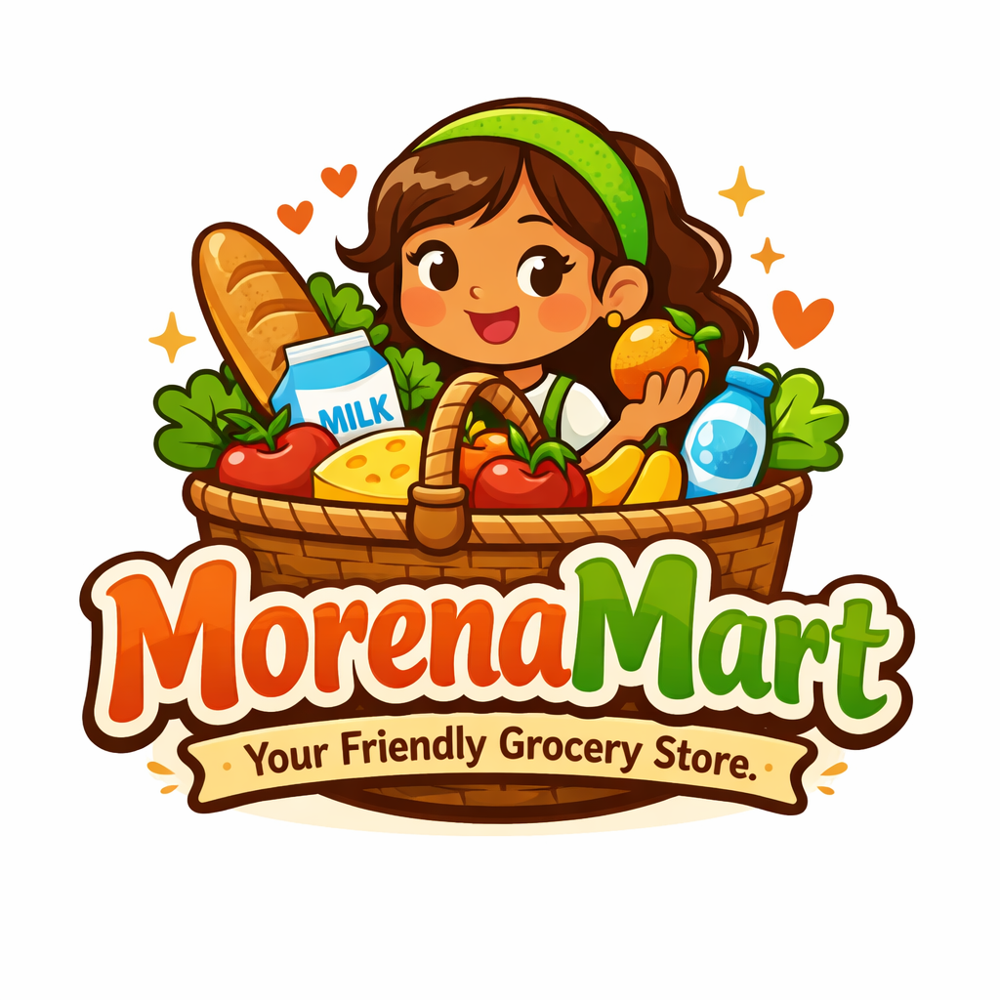
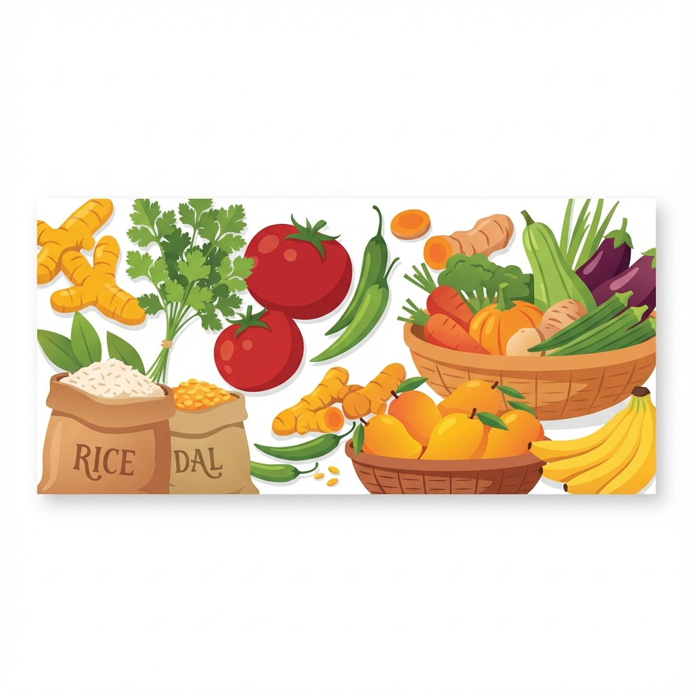

<div align="center">

  

  # MorenaMart 🛒
  ### Fresh Groceries, Delivered Fast!

  <p align="center">
    Morena's #1 Trusted Neighborhood Grocery Store
  </p>

  <p align="center">
    <a href="#features">Features</a> •
    <a href="#screenshot">Screenshot</a> •
    <a href="#tech-stack">Tech Stack</a> •
    <a href="#getting-started">Getting Started</a>
  </p>

  
  
  

</div>

<br />

## 📖 About The Project

**MorenaMart** is a comprehensive, responsive e-commerce web application designed for a local grocery store in Morena, India. It provides a seamless shopping experience for customers to browse and order daily essentials, fresh vegetables, dairy products, and more.

The application features a modern, mobile-first design that works perfectly on all devices, offering an app-like experience without the need for installation.

## ✨ Key Features

*   **📱 Mobile-First Design:** Fully responsive layout with mobile sidebar, bottom navigation, and touch-friendly interfaces.
*   **🛍️ Dynamic Product Catalog:** Browse products across multiple categories like Grocery, Fruits & Veggies, Dairy, Snacks, etc.
*   **🔍 Smart Search:** Quickly find products with an integrated search bar.
*   **🛒 Cart System:** Full-featured shopping cart with add/remove functionality, subtotal calculation, and discount management.
*   **💸 Coupon System:** Apply promo codes (e.g., `MORENA10`, `FIRST20`) for discounts.
*   **⚡ Fast Checkout:** Simplified checkout process integrated with WhatsApp for order confirmation.
*   **🎉 Offers & Deals:** dedicated sections for daily deals, combo offers, and festival specials.
*   **🔒 Admin Panel:** Includes a dashboard for managing store settings and products (located in `/admin`).

## 📸 Screenshots

<div align="center">
  
</div>

## 🛠️ Tech Stack

This project is built using vanilla web technologies to ensure maximum performance and compatibility.

*    **HTML5** - Semantic markup and structure
*    **CSS3** - Custom styling, Flexbox, Grid, and Animations
*    **JavaScript (ES6+)** - Core logic, DOM manipulation, and state management
*   **Lucide Icons** - Beautiful, consistent SVG icons

## 🚀 Getting Started

To get a local copy up and running, follow these simple steps.

### Prerequisites

*   A modern web browser (Chrome, Firefox, Safari, Edge)
*   A text editor (VS Code recommended) or any simple local server (optional but recommended for best experience)

### Installation

1.  **Clone the repository**
    ```sh
    git clone https://github.com/Swelo-ui/MorenaMart.git
    ```

2.  **Navigate to the project directory**
    ```sh
    cd MorenaMart
    ```

3.  **Run the application**
    *   Simply open `index.html` in your browser.
    *   OR serve using a local server (e.g., Live Server in VS Code, Python SimpleHTTPServer)
    ```sh
    # Python 3 example
    python -m http.server 8000
    ```

## 📂 Project Structure

```
MorenaMart/
├── admin/               # Admin panel files
├── images/              # Project assets (products, categories, icons)
├── styles.css           # Main stylesheet
├── mobile-app.css       # Mobile-specific styles
├── script.js            # Main application logic
├── products.js          # Product data and store configuration
├── cart.js              # Cart management logic
├── index.html           # Main entry point
└── README.md            # Project documentation
```

## 🤝 Contributing

Contributions are what make the open source community such an amazing place to learn, inspire, and create. Any contributions you make are **greatly appreciated**.

1.  Fork the Project
2.  Create your Feature Branch (`git checkout -b feature/AmazingFeature`)
3.  Commit your Changes (`git commit -m 'Add some AmazingFeature'`)
4.  Push to the Branch (`git push origin feature/AmazingFeature`)
5.  Open a Pull Request

## 📞 Contact

**MorenaMart Store**
*   📍 Address: Main Market Road, Near City Center, Morena, MP 476001
*   📞 Phone: +91 6265643703
*   💬 WhatsApp: [Click to Chat](https://wa.me/916265643703)

---

<p align="center">
  Made with ❤️ for Morena
</p>
